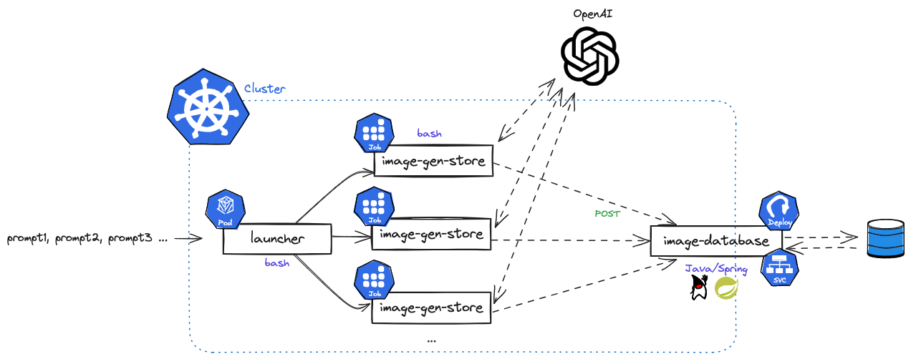

# Image Gen Demo

**Table of Contents**
- [Image Gen Demo](#image-gen-demo)
  - [Prerequisites](#prerequisites)
    - [Infrastructure](#infrastructure)
      - [Set up DigitalOcean Infrastructure](#set-up-digitalocean-infrastructure)
  - [Architecture](#architecture)
  - [Applications](#applications)
    - [Database](#database)
    - [Launcher](#launcher)
    - [Image Generator and Database store](#image-generator-and-database-store)
  - [Things to do](#things-to-do)
  - [TODO](#todo)
    - [Required](#required)
    - [Nice to have by demo](#nice-to-have-by-demo)
    - [Future work](#future-work)


## Prerequisites
Have the following CLIs:
- [kubectl](https://kubernetes.io/docs/tasks/tools/#kubectl)
- [docker](https://docs.docker.com/engine/install/)
- [jq](https://jqlang.github.io/jq/download/)
- [envsubst](https://pypi.org/project/envsubst/) (if you don't have it by default)
- [k9s](https://k9scli.io/topics/install/)

**TODO*: add kubens to not need `-n gen`*

Other:
- An OpenAI API key and API access
  
**TODO*: add docs link*

### Infrastructure
We will need a:
- Kubernetes cluster
- Container registry
- PostgreSQL database

#### Set up DigitalOcean Infrastructure
If you use the Hivenetes k8s boostrapper you can have it create all of these resources for you:


1. Clone https://github.com/hivenetes/k8s-bootstrapper
2. Follow the [Terraform instructions](https://github.com/hivenetes/k8s-bootstrapper/blob/main/infrastructure/terraform/README.md)

  > ***Note**: Enable the database in `bootstrapper.tfvars` before running `terraform plan`. You can also enable the container registry if you want to use it instead of Docker Hub.*

## Architecture


## Applications


### Database
This is a Java application that uses Spring Data and Spring Web to create a database table to store 


### Launcher
This application takes in prompts for OpenAI and launches jobs for each prompt.


### Image Generator and Database store


## Things to do
0. Create gen namespace 
   ```console
   kubectl apply -f k8s/namespace.yaml
   ```
1. [Create and run database app](apps/image-database/README.md)
2. [Create and run image generator and store app](apps/image-gen-store/README.md)
3. [Create and run launcher app](apps/launcher/README.md)
4. TODO: Observability

## TODO
### Required
- [ ] Use DOCR instead of Docker Hub

### Nice to have by demo
- [ ] Display prompts and URLs as images on webpage

### Future work
- [ ] Use DigitalOcean spaces to store secrets
- [ ] Create service account vs using default one
- [ ] Have a webpage to put prompts into vs running a pod
- [ ] Add image creation dates so the database can drop anything that has a timestamp before a current subset -- e.g. OpenAI Dall-E only stores images for an hour, so after this, the URLs don't work.
